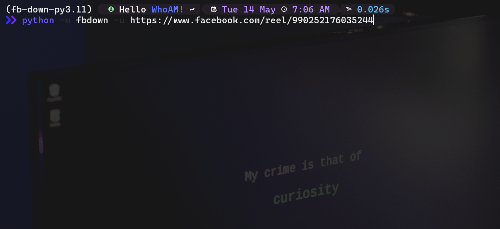

<div align="center">


**Fb-Down** is a downloader made especially for `reels` or `regular videos` that you can download from Facebook.



</div>

## **Installation**

**Using** _`poetry`_

```
git clone https://github.com/x404xx/Fb-Down.git
cd Fb-Down
poetry shell
poetry install
```

**Using** _`pip`_

```
git clone https://github.com/x404xx/Fb-Down.git
cd Fb-Down
virtualenv env
env/scripts/activate
pip install -r requirements.txt
```

## URL Example

-   _`Reels Video URL`_ > https://www.facebook.com/reel/990252176035244
-   _`Regular Video URL`_ > https://fb.watch/s1tc9-zq-y/

## Usage

```
usage: python -m fbdown [-h] -u VIDEO_URL [-od OUTPUT_DIR] [-q] [-nw] [-er]

Download a (regular video|reels) from facebook.

options:
  -h, --help            show this help message and exit
  -u VIDEO_URL, --video_url VIDEO_URL
                        The URL of the video to download.
  -od OUTPUT_DIR, --output_dir OUTPUT_DIR
                        The directory where the video will be saved. Defaults to current project directory.
  -q, --quiet           Whether to run the download quietly. Defaults to False.
  -nw, --no_warn        Whether to suppress warnings. Defaults to False.
  -er, --end_ret        Whether to return to the beginning of the line after printing progress. Defaults to False.
```

## Usage Example

```
python -m fbdown -u https://www.facebook.com/reel/990252176035244
```

## Output

-   [Downloaded Videos](https://github.com/x404xx/Fb-Down/tree/main/Facebook%20Videos)

## **Legal Disclaimer**

> [!Note]
> This was made for educational purposes only, nobody which directly involved in this project is responsible for any damages caused. **_You are responsible for your actions._**
